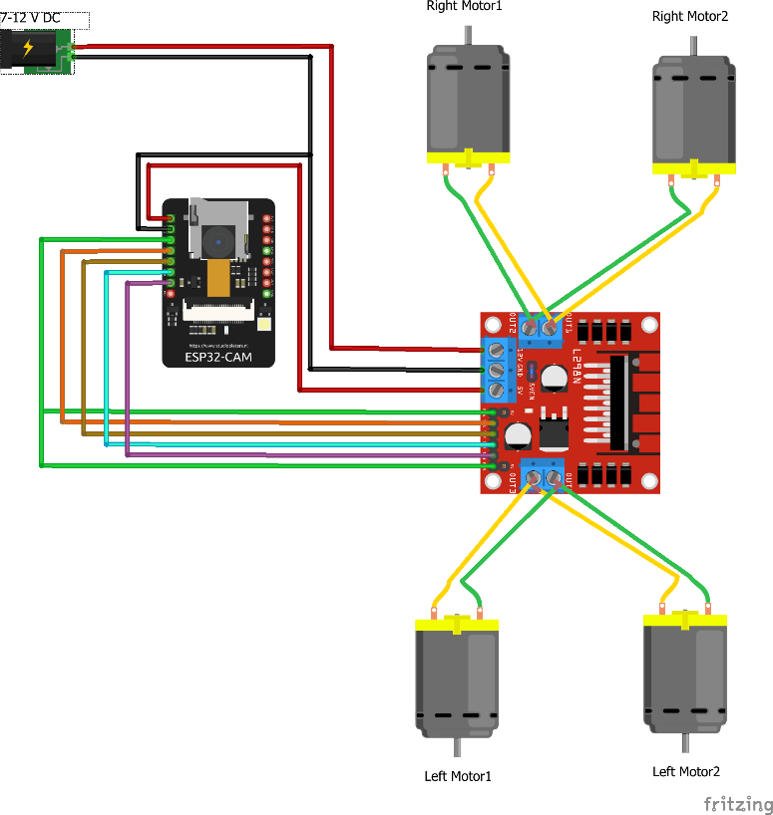
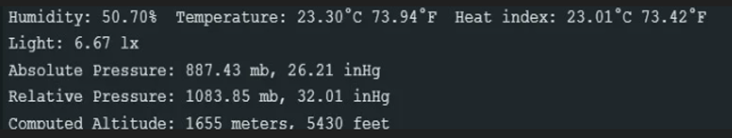

# Remote Weather Detection IoT Car

An IoT project combining a **Wi-Fi-controlled robotic car** with an onboard **long-range weather station**.

The car is driven remotely over its own Wi-Fi access point via a browser-based control panel with a live camera feed, while a companion sensor module mounted on the chassis continuously measures environmental conditions (temperature, humidity, heat index, light level) and transmits them over a long-range **LoRa (433 MHz)** radio link to a separate base-station receiver — independent of the Wi-Fi connection, and usable from much farther away.


A demo video of the finished build in action is included in the repository: [`project video.mp4`](project%20video.mp4).

--

## Table of Contents

1. [System Overview](#system-overview)
2. [Architecture](#architecture)
3. [Hardware](#hardware)
4. [Wiring & Pin Maps](#wiring--pin-maps)
5. [Firmware](#firmware)
6. [Web Control Interface](#web-control-interface)
7. [Communication Protocols](#communication-protocols)
8. [Repository Structure](#repository-structure)
9. [Getting Started](#getting-started)
10. [Sample Output](#sample-output)
11. [Known Issues & Limitations](#known-issues--limitations)
12. [Possible Improvements](#possible-improvements)
---

## System Overview

The project has **three cooperating subsystems**, each running on its own microcontroller:

1. **Remote-Control Car (ESP32-CAM)** — a 4-wheel-drive chassis driven by an ESP32-CAM. The ESP32 hosts its own Wi-Fi access point and a small web application (HTML/JS served over HTTP + two WebSocket channels) that lets an operator steer the car, adjust speed, toggle a headlight, and watch a live camera stream, all from a phone or laptop browser — no app install or internet connection required.
2. **Weather Station (Arduino UNO)** — mounted on the same chassis, this board reads ambient temperature, humidity, heat index, and light level, then broadcasts them as a formatted text packet over a 433 MHz LoRa radio every ~2 seconds.
3. **Base-Station Receiver (Arduino UNO)** — a separate, stationary Arduino with its own LoRa module that listens for incoming weather packets and prints them to the Serial Monitor, giving the operator live environmental readouts from the car's location without needing Wi-Fi range.

The car-control link (Wi-Fi) and the weather-telemetry link (LoRa) are **fully independent** — this is a deliberate design choice: Wi-Fi gives high-bandwidth control + video at short range, while LoRa gives long-range, low-bandwidth sensor telemetry that keeps working well beyond Wi-Fi range.

## Architecture

```
                         ┌─────────────────────────────┐
                         │        REMOTE CAR            │
                         │                               │
   Browser  ── Wi-Fi ──▶ │  ESP32-CAM                   │
  (control page,         │   • Wi-Fi SoftAP "MyWiFiCar" │
   camera view,          │   • HTTP server (port 80)    │
   joystick buttons,     │   • WebSocket /Camera  (video)│
   speed/light sliders)  │   • WebSocket /CarInput (cmds)│
                         │   • L298N → 4× DC motors     │
                         │   • Onboard camera (OV2640)  │
                         └───────────────┬───────────────┘
                                         │ (mounted on same chassis)
                         ┌───────────────▼───────────────┐
                         │      WEATHER STATION           │
                         │  Arduino UNO                   │
                         │   • DHT22 (temp/humidity)      │
                         │   • BH1750 (light, I2C)        │
                         │   • LoRa TX module (433 MHz)   │
                         └───────────────┬───────────────┘
                                         │ LoRa radio (433 MHz)
                                         ▼
                         ┌───────────────────────────────┐
                         │      BASE STATION (fixed)      │
                         │  Arduino UNO                   │
                         │   • LoRa RX module (433 MHz)   │
                         │   • Prints readings to Serial  │
                         │     Monitor                     │
                         └───────────────────────────────┘
```

## Hardware

### Car / Drive Subsystem
| Component | Notes |
|---|---|
| ESP32-CAM (AI-Thinker) | Main controller; integrated Wi-Fi + OV2640-class camera |
| 4WD acrylic chassis | 4 wheels, 4 DC gear motors |
| L298N dual H-bridge motor driver | Drives all 4 motors as two logical sides (left/right) |
| Battery pack (~7–14V) | Powers motors via L298N |
| Power switch | |
| Jumper wires | |

### Weather Station Subsystem
| Component | Notes |
|---|---|
| Arduino UNO | Runs `sender_code.ino` |
| DHT22 | Temperature + humidity sensor, single-wire digital |
| BH1750 | Ambient light sensor (lux), I2C |
| LoRa transceiver module (e.g. SX1278, 433 MHz) | SPI-connected |
| 9V battery | Independent power source from the car's drive battery |

### Base-Station / Receiver Subsystem
| Component | Notes |
|---|---|
| Arduino UNO | Runs `receiver_code.ino` |
| LoRa transceiver module (433 MHz) | SPI-connected, matching frequency with the sender |
| USB connection to PC | For Serial Monitor readout |

## Wiring & Pin Maps

### Weather Station — Arduino UNO
| Peripheral | Signal | Arduino Pin |
|---|---|---|
| DHT22 | VCC | 5V |
| DHT22 | GND | GND |
| DHT22 | Data | D7 |
| BH1750 | SCL | A5 (I2C) |
| BH1750 | SDA | A4 (I2C) |
| LoRa module | VCC | 3.3V |
| LoRa module | GND | GND |
| LoRa module | MISO | D12 |
| LoRa module | MOSI | D11 |
| LoRa module | SCK | D13 |
| LoRa module | NSS / CS | D10 |
| LoRa module | DIO0 (interrupt) | D2 |

### Base-Station Receiver — Arduino UNO
Identical LoRa pin mapping to the sender above (VCC→3.3V, GND→GND, MISO→D12, MOSI→D11, SCK→D13, NSS/CS→D10, DIO0→D2), so both radios use matching SPI wiring.

### Car — ESP32-CAM ↔ L298N Motor Driver
```cpp
motorPins = {
  { EnA: 12, IN1: 13, IN2: 15 },  // RIGHT_MOTOR
  { EnB: 12, IN3: 14, IN4: 2  },  // LEFT_MOTOR
};
#define LIGHT_PIN 4   // Headlight LED, PWM output
```
- Motors 1 & 2 (right side) → L298N `OUT1`/`OUT2`
- Motors 3 & 4 (left side) → L298N `OUT3`/`OUT4`
- L298N `IN1`–`IN4` → ESP32-CAM GPIOs as above
- L298N `VCC`/`GND` → ESP32-CAM `5V`/`GND`
- Drive battery `+`/`−` → L298N `VCC`/`GND`

### ESP32-CAM (AI-Thinker) Camera Pins
```cpp
PWDN = 32, RESET = -1, XCLK = 0, SIOD = 26, SIOC = 27,
Y9 = 35, Y8 = 34, Y7 = 39, Y6 = 36, Y5 = 21, Y4 = 19, Y3 = 18, Y2 = 5,
VSYNC = 25, HREF = 23, PCLK = 22
```

> A hand-drawn/Fritzing wiring diagram for the car's ESP32↔L298N↔motor circuit, along with additional build photos, is included inside `IoT Project Report.docx`.

## Firmware

Three firmware images make up the project. Two exist as standalone Arduino sketches in this repository; the third (car control) is currently documented only inside the project report and is **not yet checked in as a separate `.ino` file**.

### 1. `sender_code.ino` — Weather Station (Arduino UNO)

Initializes the DHT22, BH1750 (over I2C), and LoRa radio (433 MHz), then every loop iteration:

1. Reads humidity, temperature (°C and °F) from the DHT22.
2. Computes heat index (°C and °F).
3. Reads ambient light level (lux) from the BH1750.
4. Packages all readings into a human-readable text packet and transmits it over LoRa.
5. Mirrors the same text to the Serial Monitor for local debugging.
6. Waits 2 seconds and repeats.

```cpp
BH1750 lightMeter;
DHT dht(7, DHT22);

void setup() {
  Serial.begin(9600);
  dht.begin();
  Wire.begin();
  lightMeter.begin();
  if (!LoRa.begin(433E6)) {
    Serial.println("Starting LoRa failed!");
    while (1);
  }
}

void loop() {
  float h = dht.readHumidity();
  float t = dht.readTemperature();
  float f = dht.readTemperature(true);
  if (isnan(h) || isnan(t) || isnan(f)) {
    Serial.println(F("Failed to read from DHT sensor!"));
    return;
  }
  float hic = dht.computeHeatIndex(t, h, false);
  float lux = lightMeter.readLightLevel();

  LoRa.beginPacket();
  LoRa.print("Humidity: "); LoRa.print(h);
  LoRa.print("%  Temperature: "); LoRa.print(t); LoRa.print("°C ");
  LoRa.print(f); LoRa.print("°F  Heat index: "); LoRa.print(hic); LoRa.println("°C");
  LoRa.print("Light: "); LoRa.print(lux); LoRa.println(" lx");
  // ... plus placeholder pressure/altitude fields (see Known Issues)
  LoRa.endPacket();

  delay(2000);
}
```

> **Note:** the pressure and altitude fields transmitted (`Absolute Pressure`, `Relative Pressure`, `Computed Altitude`) are **hard-coded constants**, not live sensor readings — see [Known Issues](#known-issues--limitations).

### 2. `receiver_code.ino` — Base-Station Receiver (Arduino UNO)

Listens on the same 433 MHz LoRa frequency and streams every received character straight to the Serial Monitor, printing a newline whenever the sender's `\n` terminator arrives:

```cpp
void setup() {
  Serial.begin(9600);
  if (!LoRa.begin(433E6)) {
    Serial.println("Starting LoRa failed!");
    while (1);
  }
}

void loop() {
  int packetSize = LoRa.parsePacket();
  if (packetSize) {
    Serial.println("Received packet");
    while (LoRa.available()) {
      char incoming = (char)LoRa.read();
      if (incoming == '\n') Serial.println();
      else Serial.print(incoming);
    }
    delay(1000);
  }
}
```

> **This file currently has two lines that will not compile** — see [Known Issues](#known-issues--limitations) for details and the fix.

### 3. Car Control — ESP32-CAM (documented in report, not yet in repo)

Runs a Wi-Fi access point, an async HTTP server serving a control-page UI, and two WebSocket endpoints — one streaming camera frames to the browser, one receiving drive commands from it.

```cpp
void setup(void) {
  setUpPinModes();
  Serial.begin(115200);
  WiFi.softAP(ssid, password);         // ssid = "MyWiFiCar"
  server.on("/", HTTP_GET, handleRoot);
  wsCamera.onEvent(onCameraWebSocketEvent);
  server.addHandler(&wsCamera);
  wsCarInput.onEvent(onCarInputWebSocketEvent);
  server.addHandler(&wsCarInput);
  server.begin();
  setupCamera();
}

void loop() {
  wsCamera.cleanupClients();
  wsCarInput.cleanupClients();
  sendCameraPicture();
}
```

Incoming commands on `/CarInput` are parsed as `"key,value"` pairs, e.g. `MoveCar,1`, `Speed,150`, `Light,80`, and dispatched to `moveCar()` or `ledcWrite()`. `moveCar()` drives the two logical motor groups (`RIGHT_MOTOR` / `LEFT_MOTOR`) via `rotateMotor()`, which sets each side's `IN1`/`IN2` pins HIGH/LOW to select forward, backward, or stop — a standard tank/differential-drive steering scheme (turning left = right side forward + left side backward, and vice versa for turning right).

## Web Control Interface

The ESP32 serves a single self-contained HTML/JS page (embedded in firmware as a `PROGMEM` string) at `http://<esp32-ip>/` once a client joins the `MyWiFiCar` access point. It provides:

- **Live camera feed** — an `` element fed by binary JPEG frames pushed over the `/Camera` WebSocket.
- **Directional controls** — four touch buttons (▲ ▼ ◀ ▶) using `ontouchstart` / `ontouchend` to send `MoveCar` commands (`1`=forward, `2`=backward, `3`=left, `4`=right, `0`=stop) over the `/CarInput` WebSocket.
- **Speed slider** (0–255) — sets motor PWM duty cycle via `ledcWrite(PWMSpeedChannel, value)`.
- **Light slider** (0–255) — sets headlight LED brightness via PWM on `LIGHT_PIN`.
- **Auto-reconnect** — if a WebSocket drops, the page retries the connection every 2 seconds.

No app installation is required — any modern mobile or desktop browser connected to the car's access point can drive it.

## Communication Protocols

| Link | Protocol | Purpose |
|---|---|---|
| Weather station → base station | LoRa @ 433 MHz (SPI-controlled radio) | Long-range environmental telemetry |
| BH1750 ↔ Arduino UNO | I²C | Light sensor readout |
| LoRa module ↔ Arduino UNO | SPI | Radio control (both sender and receiver) |
| DHT22 ↔ Arduino UNO | Single-wire digital | Temperature/humidity readout |
| Browser ↔ ESP32-CAM | Wi-Fi, SoftAP mode (`MyWiFiCar`) | Direct peer-to-peer connection, no router needed |
| Browser ↔ ESP32-CAM | HTTP (port 80) | Serves the control-page UI |
| Browser ↔ ESP32-CAM | WebSocket `/Camera` | Streams binary JPEG video frames |
| Browser ↔ ESP32-CAM | WebSocket `/CarInput` | Sends drive/speed/light commands |
| All boards | Serial / UART | Local debugging via Arduino IDE Serial Monitor |

## Repository Structure

```
Remote-Weather-Detection-IoT-Car/
├── README.md                    ← you are here
├── IoT Project.jpeg             Photo of the fully assembled car + weather station
├── project video.mp4            Demo video of the finished build in operation
├── sender_code.ino              Weather station firmware (Arduino UNO)
└── receiver_code.ino            Base-station receiver firmware (Arduino UNO)
```

> The ESP32-CAM car-control sketch is currently documented only inside the `.docx` report (see [Firmware §3](#3-car-control--esp32-cam-documented-in-report-not-yet-in-repo)). To make the project fully buildable from this repo alone, that sketch should be extracted into its own `.ino` file, e.g. `car_control_code.ino`.

## Getting Started

### Prerequisites
- **Arduino IDE** (or PlatformIO) with:
  - ESP32 board support package (for the car controller)
  - AVR/Arduino UNO board support (built in)
- Libraries (install via Library Manager):
  - `DHT sensor library` (Adafruit) — for `sender_code.ino`
  - `LoRa` by Sandeep Mistry — for both `sender_code.ino` and `receiver_code.ino`
  - `BH1750` by claws — for `sender_code.ino`
  - `Wire`, `SPI` — bundled with the Arduino core
  - For the ESP32-CAM car sketch: `ESPAsyncWebServer` and `AsyncTCP` (both by me-no-dev), plus the ESP32 core's `esp_camera.h` / `WiFi.h`

### Flashing the Weather Station
1. Wire the DHT22, BH1750, and LoRa module to an Arduino UNO per the [pin map](#weather-station--arduino-uno) above.
2. Open `sender_code.ino` in the Arduino IDE, select **Arduino Uno** as the board, and upload.
3. Open the Serial Monitor at **9600 baud** to confirm readings are being taken and transmitted.

### Flashing the Base-Station Receiver
1. Wire a second Arduino UNO's LoRa module per the [receiver pin map](#base-station-receiver--arduino-uno) — must match the sender's 433 MHz frequency.
2. Open `receiver_code.ino`, fix the two known compile errors (see [Known Issues](#known-issues--limitations) below), select **Arduino Uno**, and upload.
3. Open the Serial Monitor at **9600 baud** — incoming weather packets from the car will print as they arrive.

### Flashing the Car
1. Wire the ESP32-CAM to the L298N driver and motors per the [car pin map](#car--esp32-cam--l298n-motor-driver) above.
2. Reconstruct/obtain the car-control sketch (see repository note above) and flash it to the ESP32-CAM using an FTDI/USB-serial adapter.
3. Power on the car, then connect a phone or laptop to the **`MyWiFiCar`** Wi-Fi network.
4. Browse to the ESP32's IP address (default AP gateway is typically `192.168.4.1`) to load the control page and drive the car with live video.

## Sample Output

Serial Monitor output captured from the weather station (also embedded as a screenshot in the project report):

```
Humidity: 50.70%  Temperature: 23.30°C 73.94°F  Heat index: 23.01°C 73.42°F
Light: 6.67 lx
Absolute Pressure: 887.43 mb, 26.21 inHg
Relative Pressure: 1083.85 mb, 32.01 inHg
Computed Altitude: 1655 meters, 5430 feet
```


## Known Issues & Limitations

- **`receiver_code.ino` will not compile as committed.** It contains a stray, invalid line `import serial` (leftover Python syntax) at file scope, and calls `incoming.flushInput()` on a `char` variable, which has no such method. Both lines should simply be deleted — the sketch works correctly without them (this matches the clean version listed in the project report).
- **Pressure and altitude readings are not real sensor data.** No barometric/pressure sensor (e.g. BMP280) is wired into the build; `sender_code.ino` transmits fixed constants (`887.43 mb`, `1083.85 mb`, `1655 m`) labeled as "Absolute Pressure," "Relative Pressure," and "Computed Altitude" on every packet. Treat these three fields as placeholders, not live telemetry.
- **Hard-coded Wi-Fi credentials.** The car's access point SSID/password (`MyWiFiCar` / `12345678`) are compiled into the firmware — anyone in range who knows/guesses the password can connect and drive the car. Fine for a classroom demo; not suitable for unattended or public deployment without change.
- **Car-control firmware isn't a standalone repo file.** It only exists as a code listing inside `IoT Project Report.docx`, so the repository alone isn't sufficient to rebuild the car controller without extracting that listing first.
- **No LoRa packet framing/checksum.** The sender/receiver exchange free-form text terminated by `\n`; there's no addressing, sequence numbering, or CRC, so a receiver near other 433 MHz traffic (or a corrupted packet) has no way to detect or discard bad data.
- **DHT22 read cadence.** The sensor is polled every 2 seconds, at the edge of its ~2s minimum refresh rate — occasional `NaN` reads (silently skipped, no retry/backoff) are expected and by design.

## Possible Improvements

- Extract and commit the ESP32-CAM car-control sketch as its own `.ino` in this repository.
- Fix the two compile errors in `receiver_code.ino`.
- Add a real barometric pressure sensor (e.g. BMP280/BME280) and replace the hard-coded pressure/altitude constants with live readings.
- Add packet framing (start/end markers, checksum, or a compact binary protocol) to the LoRa link for reliability.
- Move Wi-Fi credentials to a build-time config (e.g. `secrets.h`, excluded via `.gitignore`) instead of hard-coding them in source.
- Log receiver-side weather data (e.g. to SD card or over serial to a PC script) for later analysis instead of only printing to Serial Monitor.
- Add a `platformio.ini` / library manifest so dependencies can be installed automatically rather than manually via the Arduino Library Manager.
